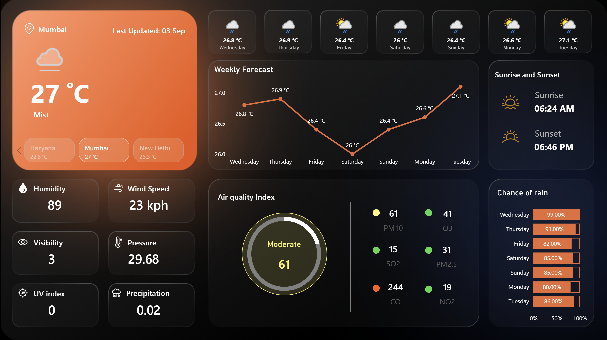

# Power BI Weather Dashboard  

India right now = ☔ umbrella, chai, and endless rains 
Me = *“Let’s make a dashboard out of it!”* 

This is a **fun Power BI project** built using data from a **Weather API**.  
To make it more engaging, I designed a **glassmorphism-inspired background in Figma** and integrated it seamlessly into Power BI.  

---

##  Features  

-  **Live Weather Data Integration** through API  
-  **Glassmorphism UI Design** (built in Figma)  
-  **Interactive & Published Power BI Dashboard**  
-  **Clean, modern, and user-friendly design**  

---

##  Dashboard Preview  

  

🔗 **View Dashboard on Power BI Service:** https://app.powerbi.com/view?r=eyJrIjoiYmNhM2FmY2EtODAxMi00YzM4LWFmNDEtNmI5MDM4YjMyN2UyIiwidCI6IjM2ZTMxOThiLWY3MzMtNDVlMS1hYzYxLWQxNjc2ZTY1OGFjNyJ9
  

---

## 🔧 Tools & Tech Used  

- **Power BI** → Data visualization & dashboarding  
- **Weather API** → Real-time weather data  
- **Figma** → Custom glassmorphism background design  
